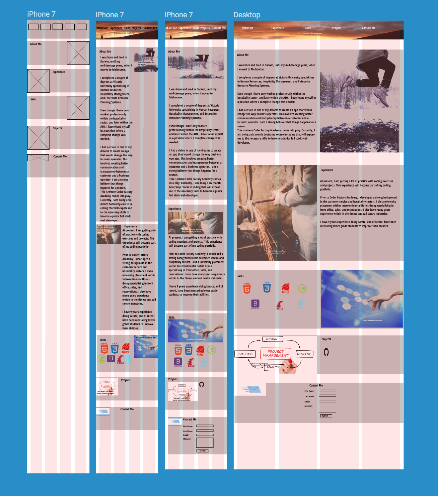
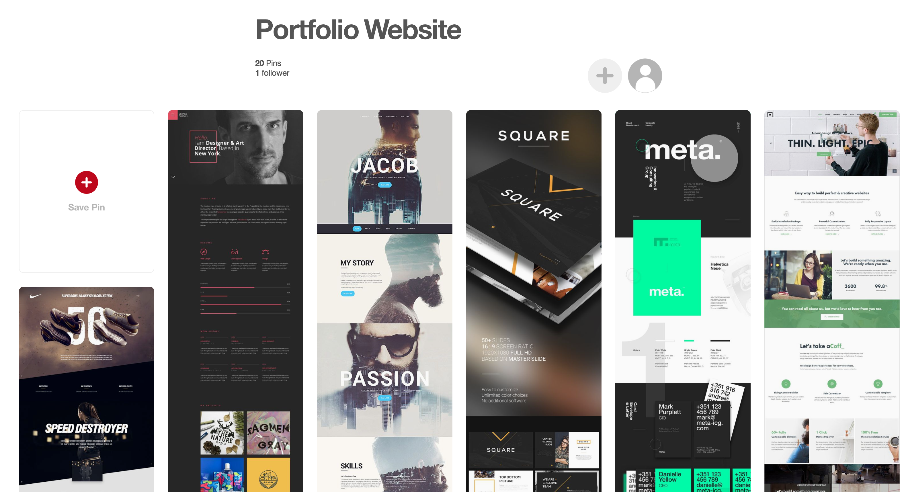

#My Portfolio Website#

##Aim, thoughts and influences##

I initially thought of doing different pages for each section of my website, but thought I would not have enough content to make my website look effective. A one page website was the desired choice for my first portfolio website. Simple and effective is the way to go!

The aim of my first project was to promote myself to potential employers for my one month internship. I wanted my website to convey my personality through the colours, pictures, and personal quotes used.

The navigation bar a picture of the sun at dawn viewed from the mountains. I used the colours of red, blue and yellow in the desktop view from 1440 pixels. If asked for my colour choice, I would say the following two things.

Firstly, red, blue and yellow are the primary / foundation colours. These foundation colours mix in different combinations to make interesting colours. An inspiration way of thinking about this is to think of a waterfall that starts with a drop of water. This drop of water turns into millions of drops producing a beautiful waterfall.

My website of code HTML and CSS is only the beginning / foundation of my journey towards being a full stack website developer. More great things are to follow.

Secondly, each colour has meaning, and I wanted to convey my personality traits of committment, strength, perservence, passion,cheerfulness, loyalty,tranquility and calmness.

On a smaller screen such as a mobile of 320 and 768 pixels, I keep the background a cement grey colour for the calming effect on the eyes.

##The Building Process##

I used Figma.com to assist in sketching out my wireframes. I felt that a navigation bar was more suited than a hamburger menu for a mobile first approach.

At this stage, I did not want to focus on the layout colours and be distracted from the objective of the task to get the outlined wireframes completed.

Below is the inspiration from Pinterest to give me the confidence to draw upon my experiences to create and convey a portfolio website that is unique to me.

##Sections##

###About Me###

It is a brief introduction about me showing where I was born, previous studies and workplaces, and most importantly why I decided for a career change in coding. I wanted to demonstrate like many others, there comes a time that you must follow your dreams and passions, and trust your gut instinct.

###Experience####

I was showing my diversity in work experience in the call centre, hospitality, fitness, and customer service industries. I also wanted to demonstrate that I display leadership skills in my extra-curricular activites.

I wanted to convey to the user that I don't only work but do other activities towards a work /life balance approach which I regard as fundamental towards emotional levelling, happiness, and workplace fulfilment and satisfaction.

###Skills####

The icons shown are the skills that will be covered at the Coder Academy Factory during my 6 months bootcamp.

###Projects###

I included a screen shot of the project I created using the Ruby language. If the user wishes they can choose to view the code in Ruby.

###Contact Me###

The contact form was created by a combination of websites: <https://formspree.io> and <https://www.w3schools.com>

Formspree gave me a workable form that is functional and will send any submissions directly to my email.

W3schools.com provided me with formattting and layout ideas for common forms.

##Tools Used##

*formspree.io

*w3school.com

*unsplashed.com

*Pinterest

*Figma

*Codepen

*HTML and CSS

*Github.com

*Devicon.fr

##Future Improvements##

Always a work in progress being updated constantly:

-add more projects

-constantly reviewing code to make improvements

-look at changing the skills and project pictures to ones that are similar in colour tone to the about me and experience pictures

-put a redirection icon at each section to bring the user back to the top of the website

##Live Website##

https//jarrodfonglim.github.io
